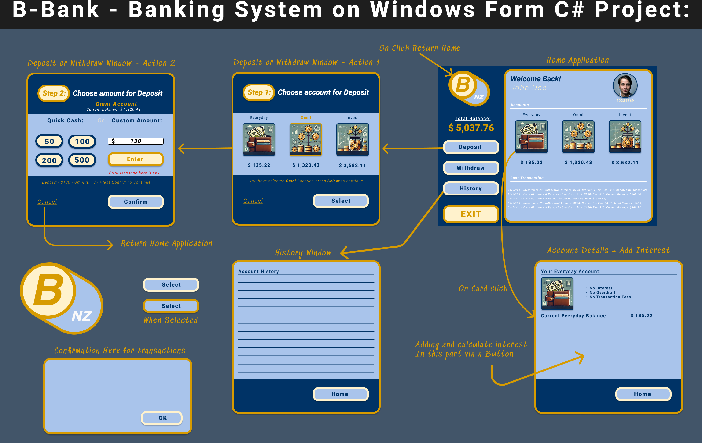

# Banking System Application

A C# Windows Forms application for managing user accounts, handling deposits, withdrawals, and displaying transaction histories. This project was developed with a focus on inheritance, encapsulation, and abstract class design to implement a simplified banking system.

## Table of Contents

- [Introduction](#introduction)
- [Features](#features)
- [Installation](#installation)
- [Usage](#usage)
- [Project Structure](#project-structure)
- [Development](#development)
- [License](#license)

## Introduction

This project demonstrates a basic banking application with functionality for different account types such as Everyday, Omni, and Invest accounts. The application leverages object-oriented principles in C# to provide a modular and extendable codebase.

**Note:** If you're developing or running this project on a Mac, you will need to use a Windows virtual machine. The project was tested on VMware Fusion running Windows 11.

## Features

- **User Management**: Creation of user accounts.
- **Account Types**: Support for Everyday, Omni, and Invest accounts with unique behaviors.
- **Transaction Handling**: Deposit, withdraw, and transaction history management.
- **Custom UI Components**: Implementation of custom panels and buttons with border radius and border width.
- **Validation**: Includes basic validation for deposits and withdrawals.

  

## Installation

### Prerequisites

- **Windows OS** (Required for running Windows Forms applications)
- **VMware Fusion** (For Mac users running Windows 11 in a virtual machine)
- **Visual Studio** (For development and compilation)

### Steps

1. **Clone the repository:**

   ```
   git clone https://github.com/your-username/your-repo-name.git
   '''

2. **Open the project in Visual Studio:**
- Open Visual Studio.
- Go to `File > Open > Project/Solution`.
- Select the `.sln `file from the cloned repository.

3. ** Build and run the application:**
-  You can run the app by pressing the `F5 `key or by selecting `Debug > Start Debugging` from the menu.

## Usage


